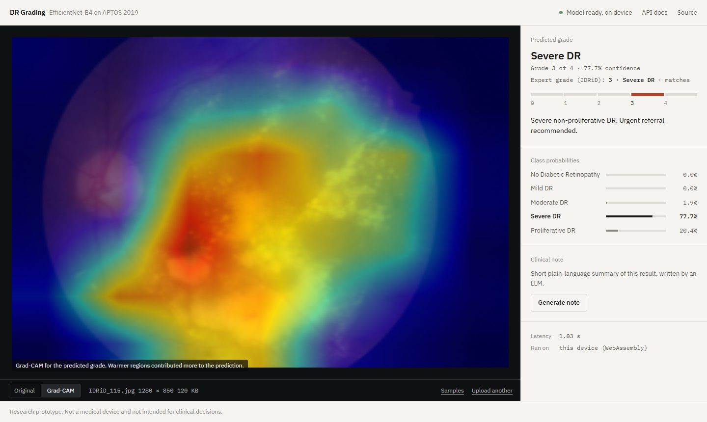
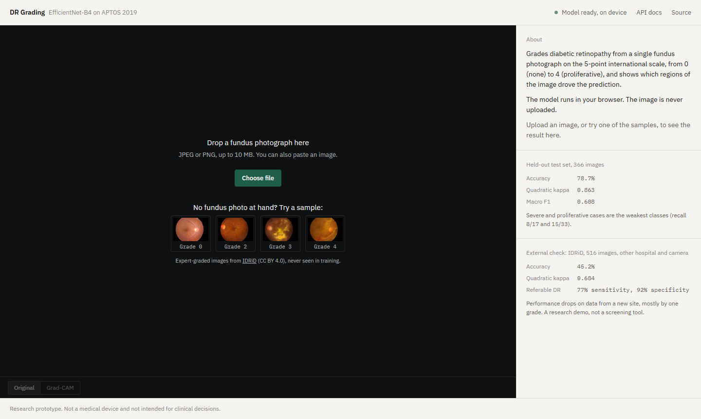
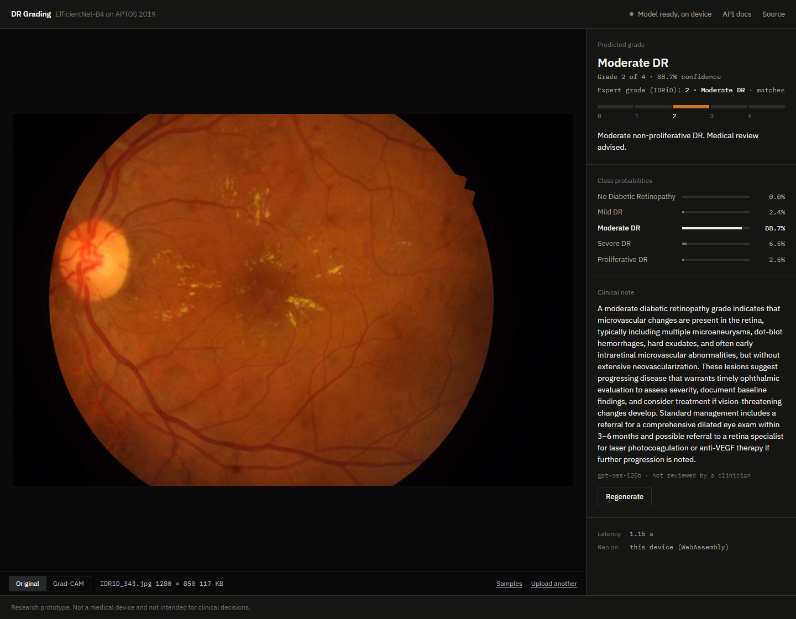
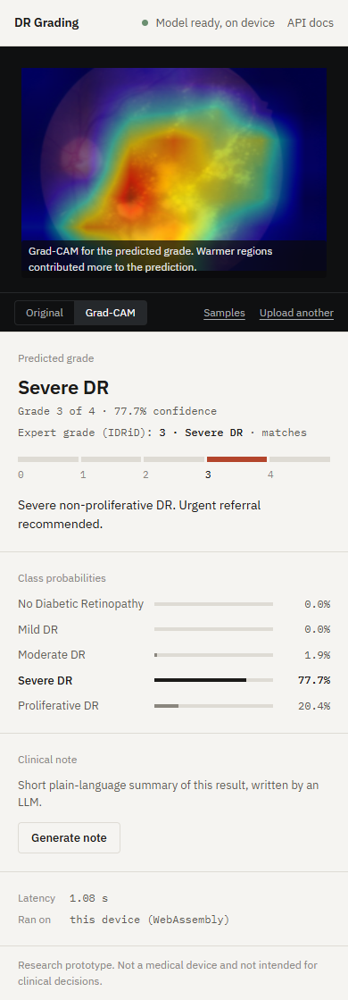

# Medical Imaging Diagnosis API


A production-ready REST API for **diabetic retinopathy severity classification** from retinal fundus images. Returns a diagnosis, confidence score, a Grad-CAM heatmap, and an optional LLM-written clinical note (Llama 3.1 8B via Hugging Face Inference Providers).

Built with EfficientNet-B4 fine-tuned on the [APTOS 2019 Blindness Detection](https://www.kaggle.com/c/aptos2019-blindness-detection/data) dataset. Ships with a web UI, full monitoring via Prometheus and Grafana, 41 tests, and a GitHub Actions pipeline that tests and deploys it.

**Model performance:** on the held-out APTOS test split (366 images) accuracy **78.7%**, quadratic weighted kappa **0.863**. On **IDRiD**, an external dataset from a different hospital and camera (516 images), kappa drops to **0.684** and accuracy to **45.2%**; referable-DR sensitivity / specificity there is **77% / 92%**. See [Model Performance](#model-performance) and [External validation](#external-validation-idrid).

> **Disclaimer:** This tool is for research purposes only and does not constitute medical advice.

**Live demo: [retinal-dr-grading.netlify.app](https://retinal-dr-grading.netlify.app)** — the model runs in your browser, the image is never uploaded. Full API with interactive docs: [la-rezzoug--dr-grading.modal.run/docs](https://la-rezzoug--dr-grading.modal.run/docs) (may take ~15 s to wake up). How it is hosted: [Deployment](#deployment). To run everything locally, see [Quick Start](#quick-start).



<sub>Sample IDRiD_115 (expert grade 3, Severe). The model, which never saw IDRiD, grades it Severe and the Grad-CAM heat sits on the hard-exudate fields. Image: IDRiD, CC BY 4.0, see [Data and licences](#data-and-licences).</sub>

### Ways to run it

| | What you get | How |
|---|---|---|
| **Live demo** (portfolio) | Web UI, model runs in the browser, LLM note via the hosted API | [retinal-dr-grading.netlify.app](https://retinal-dr-grading.netlify.app), see [Deployment](#deployment) |
| **Docker Compose** (full stack, local) | API + web UI + Prometheus + Grafana dashboard | `docker-compose up --build`, see [Quick Start](#quick-start) |
| **Modal** (hosted API) | The same FastAPI app with live `/docs` | `modal deploy deploy/modal_app.py`, see [Full API (Modal)](#full-api-modal) |

---

## Architecture

```
Client (browser or API)
        │
        ▼
┌──────────────────────────────────────────┐
│              FastAPI  :8000              │
│                                          │
│  GET  /          → Web UI                │
│  POST /predict   → EfficientNet-B4       │    ┌──────────────────────┐
│                    + Grad-CAM heatmap ───┼───▶│  HF Hub              │
│  POST /explain   → LLM clinical note     │    │  best_model.pth      │
│  GET  /metrics   → Prometheus scrape     │    └──────────────────────┘
└──────────────────────────────────────────┘
        │  scrape /metrics every 15s
        ▼
┌───────────────────┐      query      ┌──────────────────────┐
│   Prometheus :9090│ ──────────────▶ │   Grafana  :3000     │
│   (time-series DB)│                 │   (dashboards)       │
└───────────────────┘                 └──────────────────────┘
```

---

## Features

- **5-class DR classification** — No DR / Mild / Moderate / Severe / Proliferative
- **Grad-CAM explainability** — heatmap overlay showing which retinal regions drove the prediction
- **Sample images** — four expert-graded IDRiD photos (grades 0, 2, 3, 4) in the UI, so visitors can try it without their own fundus image; the result shows the expert grade next to the model's
- **External validation** — evaluated on all 516 IDRiD images (never used in training), with bootstrap confidence intervals
- **LLM clinical note**: an instruct model writes a short plain-language summary of each prediction. Hugging Face Inference Providers by default, or any OpenAI-compatible API (e.g. Groq's free tier) via `EXPLAIN_BASE_URL`
- **Web UI**: image viewer with an Original / Grad-CAM toggle (heatmap aligned to the photo), grade on the 0–4 scale, class probabilities, request ID and latency, light and dark mode
- **Prometheus + Grafana monitoring** — latency, request counts, per-class prediction counts, confidence distribution
- **Production serving** — model loaded in FastAPI `lifespan`, inference off the event loop, typed request/response schemas, upload size cap, split liveness/readiness probes
- **Structured JSON logging** — every log line and error response carries an `X-Request-ID`
- **In-browser inference** — ONNX export with Grad-CAM built into the graph, run by ONNX Runtime Web; same grades as the server on the test set (see [Deployment](#deployment))
- **Public-demo ready** — CORS allow-list for a separately hosted frontend, per-IP rate limit on the inference endpoints
- **41 tests** — model architecture, inference logic, API endpoints, validation, rate limiting, ONNX export equivalence, LLM provider wiring, sample serving and error paths
- **GitHub Actions CI/CD** — tests on every push, then redeploys the API to Modal
- **One-command Docker deployment** — `docker-compose up --build`

---

## Quick Start

**Requirements:** Docker and Docker Compose installed.

### 1. Clone and start

```bash
git clone https://github.com/REZZOUGAICHA/Medical-Imaging-Diagnosis-API.git
cd Medical-Imaging-Diagnosis-API
docker-compose up --build
```

Model weights are downloaded automatically from [Hugging Face Hub](https://huggingface.co/aicharzg/diabetic-retinopathy-efficientnet-b4) on first startup.

This starts three services:

| Service    | URL                        | Purpose                         |
|------------|----------------------------|---------------------------------|
| API + UI   | http://localhost:8000      | Web UI and inference endpoints  |
| Prometheus | http://localhost:9090      | Metrics storage                 |
| Grafana    | http://localhost:3000      | Monitoring dashboard            |

Grafana login: the `GRAFANA_ADMIN_USER` / `GRAFANA_ADMIN_PASSWORD` you set in `.env`.

### 2. Configuration

Copy the template and fill it in (compose refuses to start without a Grafana password):

```bash
cp .env.example .env
```

| Variable | Purpose | Default |
|----------|---------|---------|
| `HF_TOKEN` | Enables `POST /explain`. Needs the *Make calls to Inference Providers* permission | unset → `/explain` returns 503 |
| `EXPLAIN_MODEL` | Chat model used by `/explain` | `meta-llama/Llama-3.1-8B-Instruct` |
| `EXPLAIN_BASE_URL` | Use an OpenAI-compatible API instead of HF, e.g. `https://api.groq.com/openai/v1` | unset → HF Inference Providers |
| `EXPLAIN_API_KEY` | Key for `EXPLAIN_BASE_URL` | — |
| `EXPLAIN_MAX_TOKENS` | Token budget for the note (raise it for reasoning models) | `200` |
| `EXPLAIN_REASONING_EFFORT` | Sent as `reasoning_effort` when set (e.g. `low` for gpt-oss) | unset |
| `MAX_UPLOAD_MB` | Upload size cap for `/predict` | `10` |
| `LOG_LEVEL` | Log verbosity | `INFO` |
| `ALLOWED_ORIGINS` | Comma-separated browser origins allowed by CORS (e.g. your Netlify URL) | empty → same-origin only |
| `RATE_LIMIT_PER_MINUTE` | Max `/predict` + `/explain` calls per client IP per minute (429 when exceeded) | `0` → off |
| `GRAFANA_ADMIN_USER` / `GRAFANA_ADMIN_PASSWORD` | Grafana login | password required |

The container runs as a non-root user (uid 1000). If you bind-mount `./models` on Linux, make sure it is writable by that uid so the first-boot weight download succeeds.

---

## Web UI

Open the [live demo](https://retinal-dr-grading.netlify.app), or **http://localhost:8000** when running locally:

1. Drop, choose or paste a fundus image (JPEG or PNG), or click one of the **samples**
2. The side panel shows the predicted grade on the 0–4 scale, confidence and all class probabilities. For a sample it also shows the expert grade and whether the model matches it
3. Switch the viewer to **Grad-CAM** to see which regions drove the prediction. The heatmap is computed on the 224 × 224 model input and stretched back to the photo's aspect ratio so it lines up
4. **Generate note** asks the LLM for a short plain-language summary. The prompt tells it the scores are the model's certainty, not the patient's risk, and the code flags close calls (top two grades within 15 points) so the note says the model was uncertain

| Start screen with samples | Clinical note (dark mode) | Phone |
|---|---|---|
|  |  |  |

---

## API Reference

Interactive schema docs for every endpoint are at `/docs`. All error responses have the shape `{"detail": "...", "request_id": "..."}`; the same ID is returned in the `X-Request-ID` header and appears in the server logs, so a failure can be traced from the client to the exact log line.

### `GET /health/live`
Liveness — the process is up. Always 200 while the server runs.

### `GET /health/ready`
Readiness — the model is loaded and inference is possible. Returns **503** until startup finishes, or permanently if the weights failed to load (the process keeps running so the error shows up in the logs instead of a restart loop).

```json
{
  "status": "ready",
  "model_loaded": true,
  "model": "EfficientNet-B4",
  "device": "cpu",
  "explanation_service": true
}
```

`GET /health` is kept as an alias of `/health/ready` for existing monitors.

### `GET /model-info`
Returns model metadata and class labels.

### `POST /predict`
Accepts a retinal fundus image (JPEG or PNG, max 10 MB) and returns a diagnosis. The `Content-Type` header is only a first filter — the file must actually decode as a JPEG or PNG. Returns 400 for invalid images, 413 for oversized uploads, 429 when the rate limit is hit, 503 if the model isn't loaded.

**Request:**
```bash
curl -X POST http://localhost:8000/predict \
  -F "file=@retinal_image.jpg"
```

**Response:**
```json
{
  "success": true,
  "predicted_class": 2,
  "class_name": "Moderate DR",
  "description": "Moderate non-proliferative DR. Medical review advised.",
  "confidence": 0.8743,
  "probabilities": {
    "No Diabetic Retinopathy": 0.04,
    "Mild DR": 0.06,
    "Moderate DR": 0.87,
    "Severe DR": 0.02,
    "Proliferative DR": 0.01
  },
  "gradcam_heatmap": "<base64-encoded PNG>",
  "disclaimer": "This tool is for research purposes only..."
}
```

Decode the heatmap to visualize:

```python
import base64, io
from PIL import Image

img = Image.open(io.BytesIO(base64.b64decode(response["gradcam_heatmap"])))
img.show()
```

### `POST /explain`
Sends the prediction to a chat model through Hugging Face Inference Providers and returns a short plain-language note.

**Request:**
```bash
curl -X POST http://localhost:8000/explain \
  -H "Content-Type: application/json" \
  -d '{"class_name": "Moderate DR", "confidence": 0.87, "probabilities": {"Moderate DR": 0.87, "Mild DR": 0.06}}'
```

**Response:**
```json
{
  "explanation": "Moderate non-proliferative diabetic retinopathy indicates...",
  "model": "meta-llama/Llama-3.1-8B-Instruct"
}
```

Body is validated: `class_name` 1–64 chars, `confidence` in [0, 1] (422 otherwise). Requires `HF_TOKEN`; returns 503 without it, 502/504 if the upstream model fails or times out.

### `GET /metrics`
Prometheus-format metrics endpoint. Scraped automatically.

---

## Monitoring

Once the stack is running, open Grafana at http://localhost:3000 with the credentials from your `.env`.

The Prometheus datasource and a **Medical Imaging API** dashboard are provisioned automatically (Dashboards → Medical Imaging API). It shows request rate, `/predict` p50/p95 latency, error rate, predictions per DR grade and the confidence distribution.

To put some traffic through it (needs the APTOS test images in `data/`):

```bash
python -m scripts.load_test --n 50
```

Key metrics:

| Metric | What it shows |
|--------|--------------|
| `http_request_duration_seconds` | Inference latency distribution |
| `http_requests_total` | Request volume by endpoint and status |
| `predictions_total` | Prediction count per DR severity class |
| `prediction_confidence` | Distribution of model confidence scores |

---

## Running Tests

```bash
pip install -r requirements-dev.txt
pytest tests/ -v
```

41 tests covering model architecture, inference logic, the ONNX export (logits and Grad-CAM maps match PyTorch), all API endpoints, readiness when the model fails to load, upload size limits, spoofed content types, request validation, per-IP rate limiting, and that internal error text never reaches the client. No model weights needed — the model loader is patched in the test fixtures.

Manual smoke test against a running server:

```bash
python -m scripts.smoke_predict path/to/fundus.png --url http://localhost:8000
```

---

## Model Performance

Evaluated with [scripts/evaluate.py](scripts/evaluate.py) on the fine-tuned checkpoint (`python -m scripts.evaluate --split test`). Single evaluation run, deterministic inference, September 2026.

| Split | Images | Accuracy | Quadratic weighted kappa | Macro-F1 |
|-------|--------|----------|--------------------------|----------|
| **Test (held out)** | 366 | **78.7%** | **0.863** | **0.608** |
| Validation* | 366 | 76.5% | 0.859 | 0.600 |

\*The validation split was used to select the best checkpoint (by validation loss), so it is not independent. The test split is the headline figure. Validation actually scores slightly below test, so the selection bias looks small; a 2-point gap on 366 images is within noise.

Quadratic weighted kappa is the APTOS 2019 competition metric: it penalises a prediction by the square of its distance from the true grade, so calling Proliferative DR "Mild" costs far more than calling it "Severe".

**Test confusion matrix** (rows = true grade, columns = predicted):

| | No DR | Mild | Moderate | Severe | Proliferative |
|---|---|---|---|---|---|
| **No DR** (199) | **195** | 3 | 1 | 0 | 0 |
| **Mild** (30) | 3 | **19** | 6 | 1 | 1 |
| **Moderate** (87) | 2 | 14 | **51** | 12 | 8 |
| **Severe** (17) | 0 | 0 | 8 | **8** | 1 |
| **Proliferative** (33) | 0 | 3 | 9 | 6 | **15** |

No DR vs DR is separated well (195/199) and most mistakes are one grade off, which is why kappa is high. The weak point is the rare classes: Severe DR recall is 8/17, Proliferative 15/33, and 3 Proliferative cases were predicted as Mild. Those are the errors that would matter clinically, so this is a research demo and not a screening tool.

### External validation (IDRiD)

The APTOS test split comes from the same source as the training data, so it says little about a new clinic. To check that, the model was run unchanged on **IDRiD** (Indian Diabetic Retinopathy Image Dataset): 516 expert-graded photos from a different hospital, population and camera (Kowa VX-10α, 4288 × 2848), none of which were used in training.

```bash
python -m scripts.evaluate_external --root "data/B. Disease Grading" --out reports/idrid.json
```

| | APTOS test (internal) | IDRiD, all 516 (external) | IDRiD official test, 103 |
|---|---|---|---|
| Accuracy | 78.7% | **45.2%** (95% CI 40.9–49.4) | 41.7% (32.0–51.5) |
| Quadratic weighted kappa | 0.863 | **0.684** (0.632–0.733) | 0.542 (0.381–0.678) |
| Referable DR sensitivity (grade ≥ 2) | — | **77.1%** (72.5–81.4) | 75.0% (63.9–85.3) |
| Referable DR specificity | — | **91.7%** (87.4–95.4) | 82.1% (69.7–93.0) |

95% intervals from 2000 bootstrap resamples. Full output in [reports/idrid.json](reports/idrid.json).

**IDRiD confusion matrix, all 516** (rows = expert grade, columns = predicted):

| | No DR | Mild | Moderate | Severe | Proliferative |
|---|---|---|---|---|---|
| **No DR** (168) | **86** | 68 | 7 | 5 | 2 |
| **Mild** (25) | 10 | **13** | 2 | 0 | 0 |
| **Moderate** (168) | 12 | 51 | **82** | 19 | 4 |
| **Severe** (93) | 1 | 6 | 39 | **38** | 9 |
| **Proliferative** (62) | 1 | 3 | 17 | 27 | **14** |

What it shows:

- **There is a real domain shift.** Accuracy falls from 79% to 45%. Kappa holds up better (0.68) because most errors are still one grade off.
- **The errors have a direction.** Healthy eyes are often called Mild (68 of 168), and Severe and Proliferative cases are graded too low. On a new site the model would over-flag healthy patients for monitoring and under-call advanced disease.
- **As a referral filter it is more usable than the 5-class accuracy suggests.** 77% of eyes needing referral are flagged, and 92% of those that don't are cleared. That is still below what a screening programme needs.
- **Cropping the black border was tested and is not the cause.** IDRiD frames have wide margins, so the retina is smaller after resizing. Cropping to the retina first, decided on IDRiD's training split and APTOS only, moved IDRiD-train kappa from 0.715 to 0.738 with no change in accuracy (46.0%), and left APTOS essentially unchanged (kappa 0.863 → 0.868, accuracy 78.7% → 78.1%). The gap is more likely camera colour, illumination and population, which calls for training on more sites or colour normalisation rather than a preprocessing tweak.

### Limitations

- Trained on one dataset (APTOS 2019). The external result above is the realistic expectation for a new clinic.
- Mild DR is the least reliable grade: 13 of 25 correct on IDRiD, 19 of 30 on APTOS, and on IDRiD many healthy eyes are pulled into it.
- Grad-CAM here is a 7 × 7 map stretched over the photo: it shows roughly where the model looked, not lesion outlines. On several IDRiD Mild cases the heat lands on the notch in the top-right corner of the camera frame, which is an artefact, not retina.
- On at least one APTOS Proliferative case the heat sits on what look like laser-treatment scars, so the model may partly be learning "already treated" rather than the disease itself. One image is not proof; it is a hypothesis worth testing.
- The clinical note is written by a general-purpose LLM and is not reviewed by a clinician.

---

## Deployment

Two free deployments, no server bill and no credit card:

```
Netlify  (static/index.html, inference="browser")
   │  model: dr_efficientnet_b4.onnx from HF Hub, run with ONNX Runtime Web (WebAssembly)
   │
   └── POST /explain only ──▶  Modal  (deploy/modal_app.py, the full FastAPI app)
                                       /predict  /explain  /docs  /metrics  and the UI in server mode
```

### Browser inference (Netlify)

The PyTorch model is exported to ONNX with [scripts/export_onnx.py](scripts/export_onnx.py). The graph returns the class logits **and a class activation map for every grade**, so the browser can show the heatmap without backpropagation.

That is exact, not an approximation. The head is `avgpool → dropout → linear`, so the gradient of a class score with respect to the last feature maps is `W[c,k] / (H·W)` at every position. Grad-CAM's channel weights are therefore just the linear weights, and the map is `ReLU(Σₖ W[c,k]·Aₖ)`. [tests/test_onnx.py](tests/test_onnx.py) checks this against Grad-CAM computed with autograd.

Checks on the export:

| Check | Result |
|-------|--------|
| ONNX vs PyTorch logits | match to 1e-4 ([tests/test_onnx.py](tests/test_onnx.py)) |
| ONNX on the test split (`python -m scripts.evaluate --split test --onnx models/dr_efficientnet_b4.onnx`) | accuracy 78.7%, QWK 0.863, macro-F1 0.608, identical confusion matrix |
| Browser (Chrome) vs server, real test images | same grade on **366 / 366** test images; browser accuracy 78.7%, QWK 0.863 |

Getting the browser to agree with the server needed one non-obvious fix: the browser's own canvas scaling gave a different grade on 2 of the first 3 test photos. Fundus photos are ~2000 px and the model sees 224 px, and canvas downscaling skips most source pixels, while PIL (used in training) averages all of them. The page now decodes the raw pixels and runs a port of PIL's bilinear resampling.

To set it up:

1. Export and upload the model once:
   ```bash
   python -m scripts.export_onnx                      # writes models/dr_efficientnet_b4.onnx (~67 MB)
   huggingface-cli upload aicharzg/diabetic-retinopathy-efficientnet-b4 models/dr_efficientnet_b4.onnx dr_efficientnet_b4.onnx
   ```
2. Import the GitHub repo in Netlify. [`netlify.toml`](netlify.toml) switches the page to browser mode.
3. Optional: set `API_BASE_URL` in Netlify to the Modal URL below. That enables the LLM clinical note and the API docs link; without it those are hidden and everything else works.

The first visit downloads the model (~67 MB) and the browser caches it after that. A prediction then takes about a second on a laptop.

### Full API (Modal)

[deploy/modal_app.py](deploy/modal_app.py) runs the same FastAPI app on [Modal](https://modal.com), which has a free monthly credit on its Starter plan. The weights are baked into the image, the app scales to zero when idle, and one container at most keeps spend bounded.

```bash
pip install modal
modal setup                                            # log in once
modal secret create dr-grading --from-dotenv deploy.env   # keys below
modal deploy deploy/modal_app.py
```

`deploy.env` (not committed):

```
ALLOWED_ORIGINS=https://<your-site>.netlify.app
RATE_LIMIT_PER_MINUTE=10
# LLM note. HF's free tier only includes $0.10/month of inference credit,
# so the live demo uses Groq's free API (no card) instead:
EXPLAIN_BASE_URL=https://api.groq.com/openai/v1
EXPLAIN_API_KEY=gsk_...
EXPLAIN_MODEL=openai/gpt-oss-120b
EXPLAIN_MAX_TOKENS=600
EXPLAIN_REASONING_EFFORT=low
```

The API is then at `https://<workspace>--dr-grading.modal.run`, with `/docs` live. After an idle period the first request waits for a cold start.

**Auto-deploy:** add repo secrets `MODAL_TOKEN_ID` / `MODAL_TOKEN_SECRET` and a repo variable `DEPLOY_MODAL=true` in GitHub. The `deploy-modal` job in CI then redeploys after every green push to `main`.

---

## Data and licences

- **APTOS 2019** (training and internal test): Kaggle competition data, usable for non-commercial, academic and educational purposes; the rules forbid redistributing it. No APTOS images are included in this repository or its screenshots.
- **IDRiD** (external validation, web UI samples, screenshots): P. Porwal, S. Pachade, R. Kamble, M. Kokare, G. Deshmukh, V. Sahasrabuddhe, F. Meriaudeau, *Indian Diabetic Retinopathy Image Dataset (IDRiD)*, IEEE Dataport, 2018, DOI [10.21227/H25W98](https://doi.org/10.21227/H25W98). Licensed under [CC BY 4.0](https://creativecommons.org/licenses/by/4.0/). The four sample images in [static/samples](static/samples) were resized; details in [static/samples/CREDITS.md](static/samples/CREDITS.md).

---

## Training

To retrain from scratch on the [APTOS 2019 Blindness Detection](https://www.kaggle.com/c/aptos2019-blindness-detection) dataset:

```bash
# 1. Install dependencies locally
pip install -r requirements.txt

# 2. Download the dataset from Kaggle:
#    https://www.kaggle.com/c/aptos2019-blindness-detection/data
#    Then place the files following this structure:
#    data/train_images/train_images/*.png
#    data/val_images/val_images/*.png
#    data/train_1.csv  (columns: id_code, diagnosis)
#    data/valid.csv

# 3. Run training
python -m src.train
```

The best checkpoint is saved to `models/best_model.pth` when validation loss improves.

**Training config** (see [src/config.py](src/config.py)):
- Image size: 224×224
- Batch size: 32
- Optimizer: Adam (lr=1e-4) with ReduceLROnPlateau
- Loss: Weighted CrossEntropyLoss (handles class imbalance)

---

## Project Structure

```
├── src/
│   ├── api.py          # FastAPI app, lifespan, middleware, endpoints
│   ├── schemas.py      # Pydantic request/response models
│   ├── logging_config.py # JSON logging + request-ID context
│   ├── config.py       # Paths and hyperparameters
│   ├── dataset.py      # PyTorch Dataset + augmentations
│   ├── gradcam.py      # Grad-CAM heatmap generation
│   ├── model.py        # EfficientNet-B4 architecture
│   ├── predict.py      # Inference logic
│   └── train.py        # Training pipeline
├── scripts/
│   ├── evaluate.py     # Accuracy / QWK / F1 on a labelled split
│   ├── evaluate_external.py # External validation on IDRiD, with bootstrap CIs
│   ├── export_onnx.py  # ONNX export with Grad-CAM maps, for the browser demo
│   ├── load_test.py    # Traffic generator for the Grafana dashboard
│   └── smoke_predict.py # Manual end-to-end check against a running server
├── static/
│   ├── index.html      # Web UI
│   └── samples/        # IDRiD sample images (CC BY 4.0) + samples.json
├── docs/screenshots/   # README screenshots
├── reports/
│   └── idrid.json      # External validation metrics
├── tests/
│   ├── conftest.py     # Shared fixtures + model mock
│   ├── test_api.py     # FastAPI endpoint tests
│   ├── test_model.py   # Model architecture tests
│   ├── test_predict.py # Inference logic tests
│   └── test_onnx.py    # ONNX export matches PyTorch and Grad-CAM
├── models/             # Model weights (not tracked in git)
├── data/               # APTOS 2019 and IDRiD (not tracked in git)
├── monitoring/
│   ├── prometheus.yml  # Prometheus scrape config
│   └── grafana/        # Grafana datasource + dashboard provisioning
├── deploy/
│   └── modal_app.py    # Full API on Modal
├── netlify.toml        # Frontend build for Netlify
├── .github/
│   └── workflows/
│       └── ci.yml      # Tests, then deploy to Modal
├── Dockerfile
├── docker-compose.yml
├── .env.example
├── requirements.txt        # Full deps (training)
├── requirements-api.txt    # Lean deps (API + Docker)
└── requirements-dev.txt    # Test deps
```

---

## Tech Stack

| Layer | Technology |
|-------|-----------|
| CV Model | EfficientNet-B4 (PyTorch) |
| API | FastAPI + uvicorn |
| Explainability | Grad-CAM (pytorch-grad-cam) |
| Clinical note | Llama 3.1 8B Instruct (Hugging Face Inference Providers) |
| Web UI | Vanilla HTML/CSS/JS (served by FastAPI) |
| Containerization | Docker + Docker Compose |
| Monitoring | Prometheus + Grafana |
| Model Hosting | Hugging Face Hub |
| CI/CD | GitHub Actions |
| Browser inference | ONNX Runtime Web (WebAssembly) |
| Hosting | Netlify (static demo) + Modal (API) |
| Dataset | [APTOS 2019 Blindness Detection](https://www.kaggle.com/c/aptos2019-blindness-detection) (Kaggle) |
